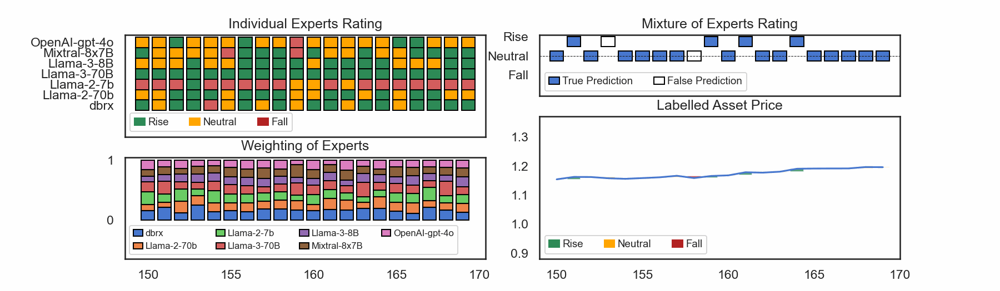
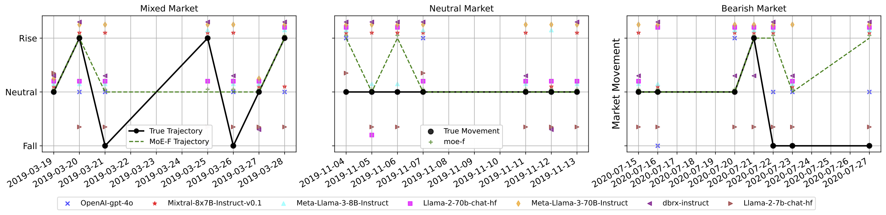
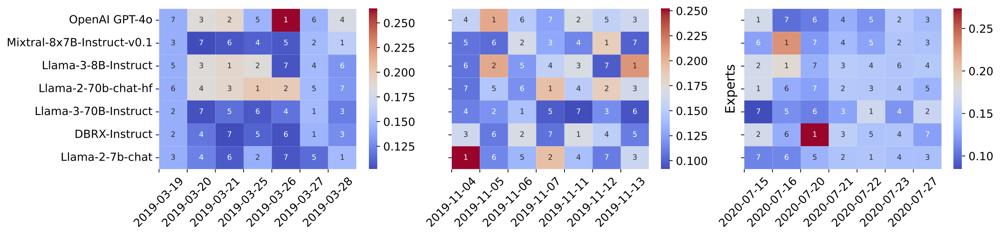
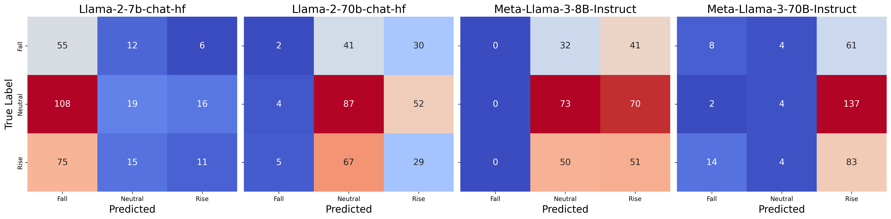

# Filtered not Mixed: Filtering-Based Online Gating for Mixture of Large Language Models 

This repository serves as the supplementary materials reposity for our proposed Mixture of Experts Filter (MoE-F) work presented.

## Concept
The following is a conceptual flow showing how MoE-F works: 



## Concrete Example
### Financial Market Movement Task <a name="fmm-task"><a/>

Examining a cross-sectional time-window snapshots allows a better understanding. 



**Expert Weights Heatmap** <a name="expert-weights-heatmap"></a>
The below diagram depicts corresponding weighting ranks of the 7 experts corresponding to the 3 randomly sampled week long trading windows with market mimicking different (bull, bear, neutral) regimes shown [above](#fmm-task). 



## Generating the Results Tables

The [experiments](./MoE-F_supplementary.materials/experiments) folder contain all expert models' results in response 
to the [NIFTY-LM](https://huggingface.co/datasets/raeidsaqur/NIFTY)'s _test split_.

To generate the main results of the paper (in Table 2), run:
`./generate_results.sh --model_name "OpenAI" --model_variant "gpt-4o" --seed 42 --average "weighted"`

Using the `model_names` and `model_variants` as desired.

```angular2html
model_names = ["Llama-2", "Llama-2", "Meta-Llama-3", "Meta-Llama-3", "Mixtral-8x7B", "dbrx", "OpenAI"]
model_variants = ["7b-chat-hf", "70b-chat-hf", "8B-Instruct", "70B-Instruct", "Instruct-v0.1", "instruct", "gpt-4o"]
```


### Experts performance on NIFTY Test Split

**Llama-class models (Llama 2,3-[7B, 8B, 70B])**



**MoE models (Mixtral_7x8B, DBRX) and GPT4o**


